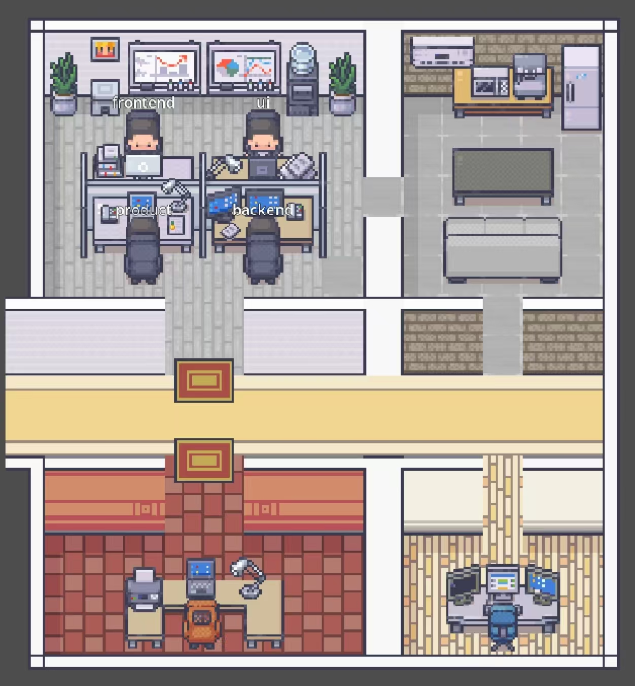
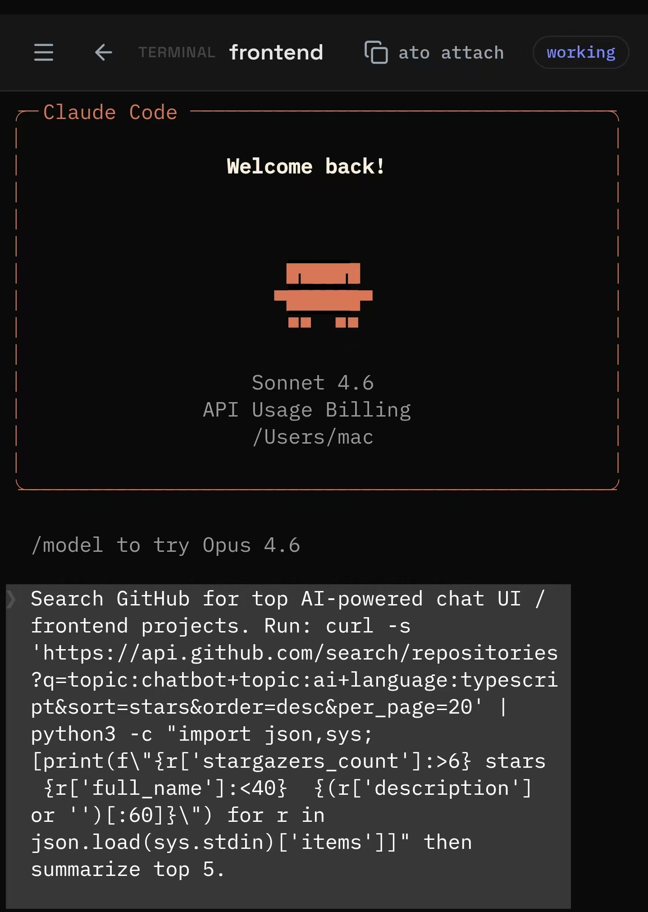

# AgentOffice

**A local-first AI office supervisor for Claude, Codex, and other terminal coding agents.**

AgentOffice runs on your machine and turns every running AI agent into an employee on a shared office floor. Each agent appears as a live worker with a real-time status — `idle`, `working`, `approval`, or `attention` — so you can see at a glance who is busy, who needs a decision, and who is waiting. Open a full-screen terminal for any employee from any browser on your network.

---

## Preview





---

## What It Does

- **Visualizes AI agents as employees** — each session appears as a live worker on the office floor with real-time status: `idle`, `working`, `approval`, or `attention`
- **Manages sessions** — launch agents from the CLI or web UI; sessions persist via tmux and survive disconnects
- **Shared terminal** — click any worker to open a full-screen xterm.js terminal, shared across local and browser clients over WebSocket
- **Remote access** — connect a relay server and access your office from anywhere
- **Multi-agent** — run Claude and Codex side by side in the same office

---

## Install

**CLI (macOS / Linux)**

```bash
npm i -g agent-office-cli
```

**Requirements:** Node.js 18+, tmux (`brew install tmux`), Claude Code or Codex CLI if you plan to use those providers.

**Android App**

Download the latest APK from [Releases](https://github.com/fakeou/agent-office/releases).

---

## Quick Start

**1. Register and create an API key**

Go to [agentoffice.top](https://agentoffice.top), create an account, and generate an API key (`sk_...`).

**2. Start the office**

Set your API key as an environment variable and run:

```bash
export AGENTOFFICE_API_KEY=sk_your_api_key
ato start
```

Or pass it directly:

```bash
ato start --key sk_your_api_key
```

**3. Launch agents** (in a new terminal):

```bash
ato claude                 # Launch a Claude Code session
ato codex                  # Launch a Codex session

ato claude -t "Review PR #42"
ato codex  -t "Fix login bug"
```

Your office is now accessible from the AgentOffice dashboard at [agentoffice.top](https://agentoffice.top).

---

## Worker States

Each employee on the office floor is always in one of four states:

| State | Meaning |
|-------|---------|
| `idle` | The agent is waiting for a task |
| `working` | The agent is actively running a task |
| `approval` | The agent is waiting for your permission to proceed |
| `attention` | The agent encountered an error or needs your input |

---

## CLI Reference

| Command | Description |
|---------|-------------|
| `ato start` | Start and connect to the AgentOffice relay (uses `AGENTOFFICE_API_KEY` env var) |
| `ato start --key sk_xxx` | Start with an explicit API key |
| `ato start --key sk_xxx --relay URL` | Start with a custom relay server |
| `ato claude` | Launch a Claude Code session |
| `ato codex` | Launch a Codex session |
| `ato attach <sessionId>` | Attach your local terminal to an existing worker |

---

## Remote Access

By default, `ato start` connects to the AgentOffice public relay at `agentoffice.top`. You can point to a different relay with the `--relay` flag:

```bash
ato start --key sk_your_api_key --relay https://your-relay.example.com
```

---

## Documentation

- [`docs/ROADMAP.md`](docs/ROADMAP.md) — Development roadmap and feature checklist
- [`docs/PROJECT_NOTES.md`](docs/PROJECT_NOTES.md) — Architecture, state model, and provider notes
- [`docs/TEST_GUIDE.md`](docs/TEST_GUIDE.md) — UI testing guide
- [`docs/PHASE3_RESEARCH.md`](docs/PHASE3_RESEARCH.md) — Phase 3 pixel-art world design research
- [`docs/PHASE3_ASSETS.md`](docs/PHASE3_ASSETS.md) — Phase 3 asset generation prompts

---

## License

MIT
